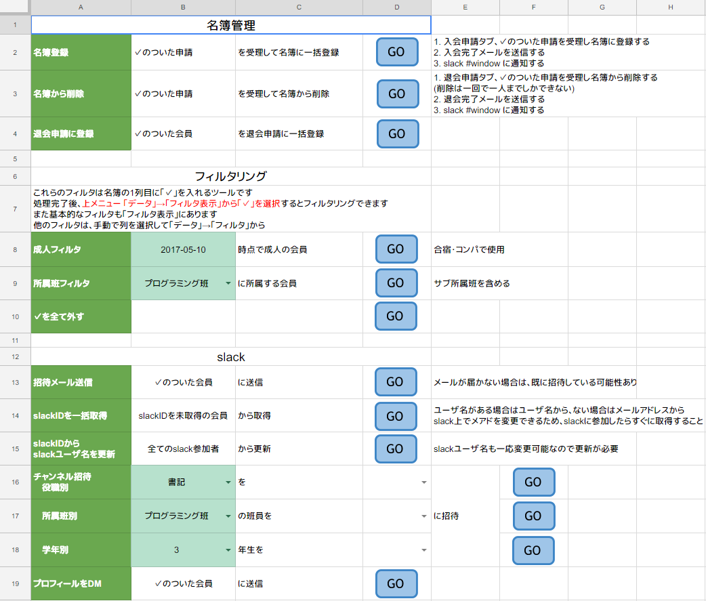

## 目次

1.	[Google Apps Scriptとは](#/2)
2.	[カラクリ](#/3)
3.	[何ができるの？](#/4)
4.	[クラスウェブ更新通知システムを作ろう](#/5)

Note:
1年生は1～3で？？？になってもOK

---

## 1. [Google Apps Script](https://developers.google.com/apps-script/) 

- **JavaScript**でGoogleのサービスをごにょごにょできる環境
- Googleのアカウントがあれば無料で使える
- しかも外部のAPIがバンバン叩ける

---

## 2. カラクリ

- Googleの強いサーバー上で動く
- Google Drive上にスクリプトを置いて稼働させる
    - 普通にJavaScriptを書いて動かす
    - 定期的に実行したり何らかのイベントに連動して発動できる

---

## 3. 何ができるの？

- **Gmailのメール送信、取得**
- **Googleスプレッドシート**(≓Excel)**でVBAっぽいこと**
- Googleカレンダーのイベント作成、取得
- Googleフォームの回答を通知する

|||

### 例えば

#### 名簿管理システム

|||

#### 名簿管理システム

- フォームからきた申請を元にスプレッドシートで名簿を作成する
- 表なので学年ごとなどフィルタリングし放題
- 新規入会者に入会完了メールを送信する (Gmail)
- Slack API関連
    - Slackの招待メールを送信する
    - メアドを元にユーザ名(@hoge)を取得
    - チャンネルに招待する

Note:

個人情報のため見せられないよ！！！  
こっから全部スプレッドシート

|||

#### 教室申請システム

- フォームから申請を募り、事務に教室申請しやすくする
- 教室を確保したらカレンダーにイベントが自動生成する

Note:
実際に見せる

- [フォーム](https://docs.google.com/forms/d/e/1FAIpQLSfZdy9avFWeaNxn-pR76HZUxHJIjvaeJN5Lxo3UJY5GtWGZAg/viewform)
- [システム](https://docs.google.com/spreadsheets/d/1-aYjYnu_IzwWzPZfQVZlb5oN2yUJesuB65XNeplEqnw/edit?usp=sharing)

|||

#### カツ丼屋

- 教室申請システムで作成したカレンダーのイベントから、1ヶ月分の活動教室一覧を生成する

Note:
みんな知ってるけど実際に見せる

- [カツ丼屋](https://docs.google.com/spreadsheets/d/1fvfUGvMu-0BC8szunT2Uz6ti34XpdKEl3lnhHNupOG8)

|||

### こんな人におすすめ

- 組織内のシステムやサービスを構築したい
- 何かを自動化したい
- サーバーで常時稼働するサービスをタダで動かしたい
- なんかAPI叩きまくりたい

---

## 4. クラスウェブ更新通知 システムを作ろう

|||

### 概要

- スプレッドシート上で動かす
- 授業資料やレポートが配信されたらSlackに通知する
- レポートのToDoリストを自動で作成する

|||

### 仕組み

- Gmailでクラスウェブ関連のメールだけフィルタリングする
    - **クラスウェブ** = Oh-o! Meiji上で授業の資料やレポートを配信しているサービス
- メールをスプレッドシート上で取得して、シートに溜めていく
    - 配布資料、レポートの2つに分ける
- レポートの場合、提出完了メールを取得してタスクを自動でチェックする

---

### 4-1. メール配信設定をする

- [Oh-o! Meiji](https://oh-o2.meiji.ac.jp)にログインしておく
- [ここ](https://oh-o2.meiji.ac.jp/portal/oh-o_meiji/home/config)から設定する
    - 自分のGmailにする
    - `クラスウェブの更新通知` 以外もチェックしてOK

Note:
初めにOh-o！ Meijiにログインしておく

---

### 4-2. Gmailでフィルタリングする

##### クラスウェブ更新のメールが来たら指定のラベルに振り分ける

1. [Gmail](https://mail.google.com/mail/u/3/)の検索バーに以下をコピペ  
`from:(ohsysmt@meiji.ac.jp) subject:(クラスウェブ更新通知【個人関連】`
2. 検索ボタン左の `▼` マーク
3. `この検索条件でフィルタを作成`
4. `ラベルをつける` -> `新しいラベル`
5. 適当な名前をつける (ex: `ClassWeb`)
6. `受信トレイをスキップ` にチェック
7. `フィルタを作成`

---

### 4-3. スプレッドシートをコピーする

Note:
曜日・時限：金曜１限他
授業名：CMP実習 III（4組）
教員名：五十嵐　悠　紀
更新内容：
・レポート(セクションB:五十嵐-4回目)が追加/更新されました。(06/15 22:50)

曜日・時限：金曜４限
授業名：コンピュータアーキテクチャ
教員名：吉　田　明　正
更新内容：
・授業内容・資料(９回目)が追加/更新されました。(06/14 18:15)